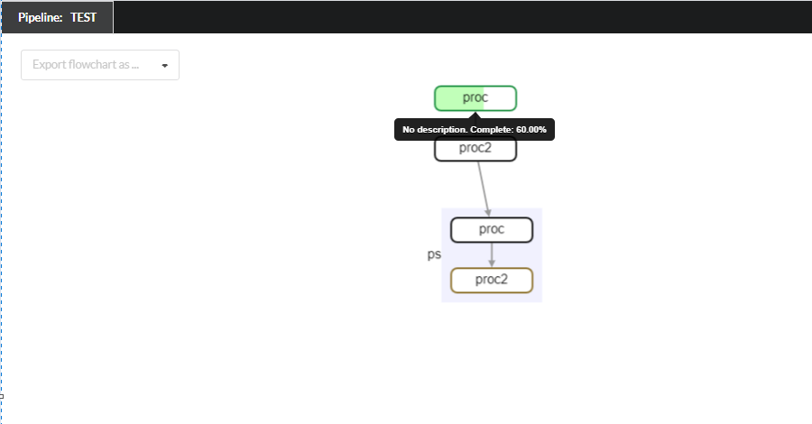
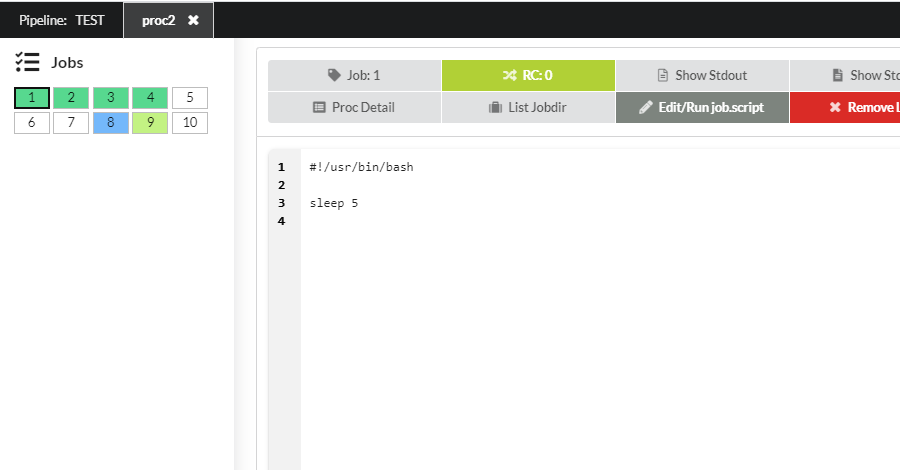

pyppl_web
=========

Installation
------------

.. code-block:: shell

   pip install pyppl_web

Configurations
--------------

.. code-block::

   # The port used to connect
   # The address will be http://localhost:<web_port>
   # Use `auto` to automatically choose a port
   web_port = DEFAULT_PORT
   # Debug mode
   web_debug = SOCKETIO_DEBUG
   # Whether keep the server alive even when pipeline finishes
   # True: keep it alive
   # False: don't
   # auto: Only keep it alive when there are clients connected
   web_keepalive = DEFAULT_KEEPALIVE

Screenshorts
------------

